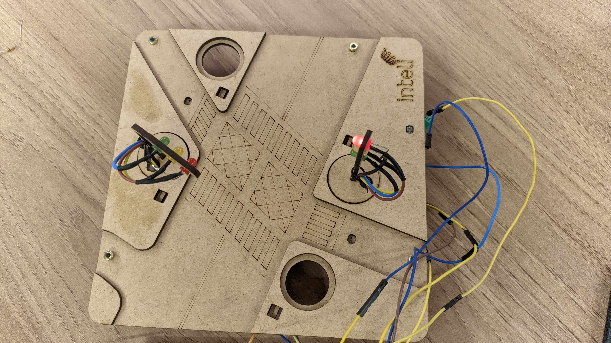
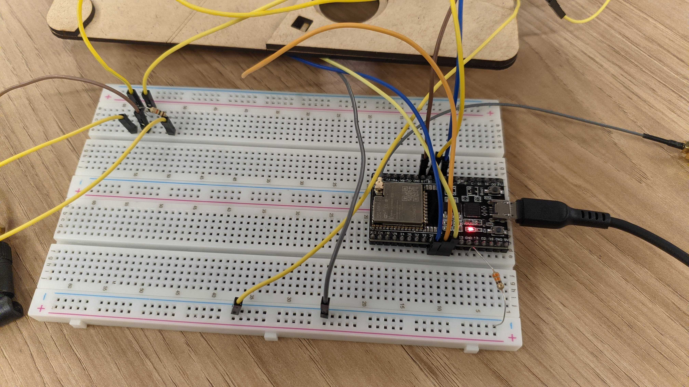
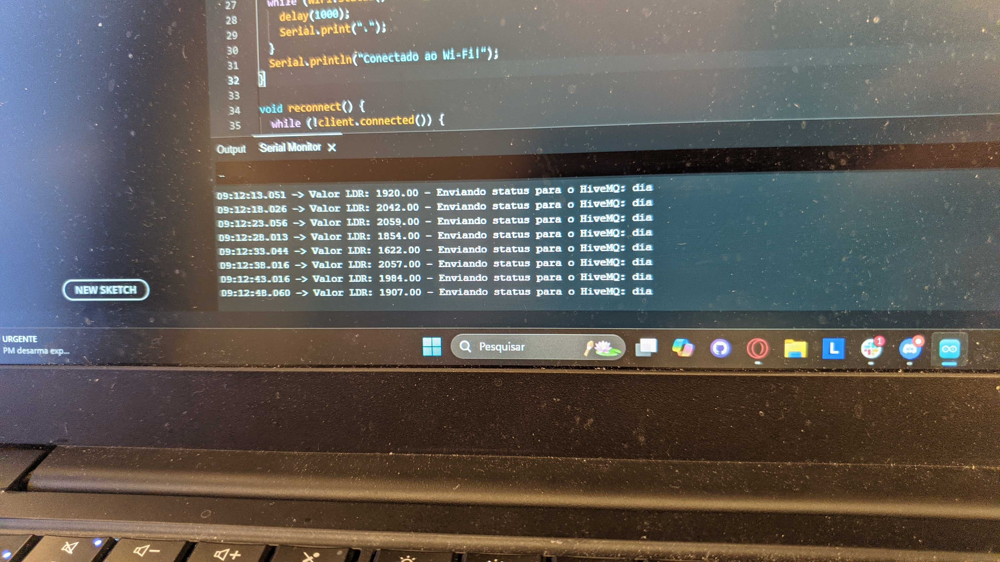

# Smart City - Semáforo Inteligente

Imagine uma cidade onde os semáforos não apenas controlam o tráfego, mas também se comunicam entre si, ajustando o fluxo de veículos de forma inteligente e eficiente. Este projeto tem como objetivo criar um sistema de semáforos inteligentes, que utilizam sensores de luz (LDR) para adaptar o comportamento de acordo com diferentes condições, como o modo noturno.

## 📑 Sumário
1. [Descrição do Projeto](#1-descrição-do-projeto)
2. [Bill of Materials](#2-bill-of-materials)
3. [Montagem Física e Programação](#3-montagem-física-e-programação)
4. [Conexão MQTT](#5-conexão-mqtt)
5. [Código](#5-código)
6. [Demonstração em Vídeo](#6-demonstração-em-vídeo)

---

## 1. Descrição do Projeto
Este projeto simula semáforos inteligentes em uma cidade. Usando sensores de luz (LDR), que, durante condições de baixa luminosidade, o sistema entra em modo noturno.

## 2. Bill of Materials
- 2 x Semáforo (com LEDs vermelhos, amarelos e verdes)
- 1 x Sensor LDR
- 2 x Resistor de 330Ω
- 2 x ESP32
- Protoboard e jumpers
- Conexão Wi-Fi
- Conta no HiveMQ

## 3. Montagem Física e Programação
### Parte 1: Montagem Física
- Os semáforos foram distribuídos onde o maior fica responsável pela avenida e o menor pela outra rua que acaba por fazer o cruzamento e ambos então conectados em seus respectivos pontos em um dos ESP32

- O LDR está seu devido espaço na plataforma e está conectado no seu ESP32.

### Parte 2: Programação
- Um ESP32 fica responsável por conectar os semáforos a rede, seu código está logo abaixo

- Agora o outro ESP32 fica responsável por estar conectado com o sensor LDR e com a antena que estabelece a conexão WI-FI para o funcionamento do MQTT através do HiveMQ

## 4. Conexão MQTT
- Cada ESP32 foi configurado para enviar dados ao HiveMQ via MQTT.

- O MQTT foi configurado para sincronizar ambos os semáforos, permitindo comunicação eficiente entre eles.

## 5. Código
Código completo do projeto, separado em seções para facilitar a leitura e compreensão:
- **Funcionamento dos semáforos**
- **Funcionamento dos sensores**

### Semáforos:

``` C++
#include <WiFi.h>
#include <WiFiClientSecure.h>
#include <PubSubClient.h>

// Configurações de Wi-Fi
const char* ssid = "Inteli.Iot";
const char* password = "@Intelix10T#";

// Configurações do HiveMQ
const char* mqtt_server = "4270349ced334e7c826e8bbf9466d1f6.s1.eu.hivemq.cloud";
const int mqtt_port = 8883;
const char* mqtt_user = "cidinha";
const char* mqtt_pass = "Cida#Abundance123";
const char* clientID = "ESP32Farol";
const char* topic = "meu/topico/teste";

// Pinos dos LEDs
const int rA = 19;
const int yA = 18;
const int gA = 17;
const int rB = 26;
const int yB = 27;
const int gB = 25;

WiFiClientSecure espClient;
PubSubClient client(espClient);
bool modoNoturno = false;

unsigned long previousMillis = 0;  // Variável para controle do tempo dos LEDs
int estado = 0;

void setup_wifi() {
  Serial.print("Conectando-se ao Wi-Fi...");
  WiFi.begin(ssid, password);
  while (WiFi.status() != WL_CONNECTED) {
    delay(1000);
    Serial.print(".");
  }
  Serial.println("Conectado ao Wi-Fi!");
}

void mqttCallback(char* topic, byte* payload, unsigned int length) {
  String message = "";
  for (int i = 0; i < length; i++) {
    message += (char)payload[i];
  }
  message.trim();

  Serial.print("Mensagem recebida: '");
  Serial.print(message);
  Serial.println("'");

  if (message == "noite") {
    modoNoturno = true;
    Serial.println("Modo Noturno: Ativado");
  } else if (message == "dia") {
    modoNoturno = false;
    Serial.println("Modo Noturno: Desativado");
  }
}

void reconnect() {
  while (!client.connected()) {
    Serial.print("Conectando ao HiveMQ...");
    if (client.connect(clientID, mqtt_user, mqtt_pass)) {
      Serial.println("Conectado!");
      client.subscribe(topic); // Inscreve-se no tópico
    } else {
      Serial.print("Falha, rc=");
      Serial.print(client.state());
      Serial.println(" Tente novamente em 5 segundos");
      delay(5000);
    }
  }
}

void controleFarol() {
  unsigned long currentMillis = millis();
  if (modoNoturno) {
    piscarAmarelo(currentMillis);  // Piscar LEDs amarelos no modo noturno
  } else {
    sequenciaSemaforo(currentMillis);  // Sequência de semáforo
  }
}

void piscarAmarelo(unsigned long currentMillis) {
  static bool ledState = false;
  if (currentMillis - previousMillis >= 500) {
    previousMillis = currentMillis;
    ledState = !ledState;
    digitalWrite(yA, ledState);
    digitalWrite(yB, ledState);
  }
}

void sequenciaSemaforo(unsigned long currentMillis) {
  switch (estado) {
    case 0:
      ligarLed(gA);
      ligarLed(rB);
      if (currentMillis - previousMillis >= 6000) {
        previousMillis = currentMillis;
        desligarLed(gA);
        desligarLed(rB);
        estado = 1;
      }
      break;
    case 1:
      ligarLed(yA);
      ligarLed(yB);
      if (currentMillis - previousMillis >= 2000) {
        previousMillis = currentMillis;
        desligarLed(yA);
        desligarLed(yB);
        estado = 2;
      }
      break;
    case 2:
      ligarLed(rA);
      ligarLed(gB);
      if (currentMillis - previousMillis >= 10000) {
        previousMillis = currentMillis;
        desligarLed(rA);
        desligarLed(gB);
        estado = 0;
      }
      break;
  }
}

void ligarLed(int led) {
  digitalWrite(led, HIGH);
}

void desligarLed(int led) {
  digitalWrite(led, LOW);
}

void setup() {
  Serial.begin(115200);

  pinMode(rA, OUTPUT);
  pinMode(yA, OUTPUT);
  pinMode(gA, OUTPUT);
  pinMode(rB, OUTPUT);
  pinMode(yB, OUTPUT);
  pinMode(gB, OUTPUT);

  setup_wifi();
  espClient.setInsecure();
  client.setServer(mqtt_server, mqtt_port);
  client.setCallback(mqttCallback);
}

void loop() {
  if (!client.connected()) {
    reconnect();
  }

  client.loop();  // Manter conexão MQTT ativa
  controleFarol();  // Controla os LEDs
}
```

### Sensores:
``` C++
#include <WiFi.h>
#include <WiFiClientSecure.h>
#include <PubSubClient.h>

// Configurações de Wi-Fi
const char* ssid = "Inteli.Iot";
const char* password = "@Intelix10T#";

// Configurações do HiveMQ
const char* mqtt_server = "4270349ced334e7c826e8bbf9466d1f6.s1.eu.hivemq.cloud";
const int mqtt_port = 8883;
const char* mqtt_user = "cidinha";
const char* mqtt_pass = "**********";
const char* clientID = "ESP32Sensor";
const char* topic = "meu/topico/teste";

// Configuração do LDR
const int ldrPin = 34;       // Pino do sensor LDR
const float limiarNoturno = 500; // Valor de limite para dia/noite

WiFiClientSecure espClient;
PubSubClient client(espClient);

void setup_wifi() {
  Serial.print("Conectando-se ao Wi-Fi...");
  WiFi.begin(ssid, password);
  while (WiFi.status() != WL_CONNECTED) {
    delay(1000);
    Serial.print(".");
  }
  Serial.println("Conectado ao Wi-Fi!");
}

void reconnect() {
  while (!client.connected()) {
    Serial.print("Conectando ao HiveMQ...");
    if (client.connect(clientID, mqtt_user, mqtt_pass)) {
      Serial.println("Conectado!");
    } else {
      Serial.print("Falha, rc=");
      Serial.print(client.state());
      Serial.println(" Tente novamente em 5 segundos");
      delay(5000);
    }
  }
}

void enviarStatusLdr() {
  float ldrValue = analogRead(ldrPin);  // Lê o valor do LDR
  String status = (ldrValue <= limiarNoturno) ? "noite" : "dia";  // Determina se é "noite" ou "dia"

  Serial.print("Valor LDR: ");
  Serial.print(ldrValue);
  Serial.print(" - Enviando status para o HiveMQ: ");
  Serial.println(status);

  client.publish(topic, status.c_str(), true);  // Publica o status no tópico MQTT com persistência
}

void setup() {
  Serial.begin(115200);
  pinMode(ldrPin, INPUT);
  setup_wifi();
  espClient.setInsecure();  // Ignora certificação para conexão SSL
  client.setServer(mqtt_server, mqtt_port);
}

void loop() {
  if (!client.connected()) {
    reconnect();
  }

  client.loop();  // Mantém a conexão MQTT ativa

  enviarStatusLdr();  // Envia o status "dia" ou "noite" com base no LDR
  delay(5000);  // Aguarda 5 segundos antes de ler e enviar novamente
}
```
## 6. Demonstração em Vídeo e Fotos
A seguir apresentamos uma demonstração do projeto e suas fotos, onde mostramos o funcionamento dos semáforos e o modo noturno.

[Link para o vídeo de demonstração](/assets/funcionamento.mp4)

<div align="center">
<sub>Figura 1 - Resultado final do Cruzamento</sub>

<sup>Fonte: Material produzido pelos autores (2024)</sup>
</div>

<div align="center">
<sub>Figura 2 - ESP 32 - semáforos</sub>

<sup>Fonte: Material produzido pelos autores (2024)</sup>
</div>

<div align="center">
<sub>Figura 3 - ESP 32 - Sensores</sub>

<sup>Fonte: Material produzido pelos autores (2024)</sup>
</div>

<div align="center">
<sub>Figura 4 - Monitor mostrando que está de dia</sub>

<sup>Fonte: Material produzido pelos autores (2024)</sup>
</div>

<div align="center">
<sub>Figura 5 - Monitor mostrando que está de dia</sub>

<sup>Fonte: Material produzido pelos autores (2024)</sup>
</div>

--- 

### ⚠️ Observações Importantes
- O LED VERDE DO MAIOR SEMÁFORO QUEIMOU, por isso ele não liga durante o vídeo
